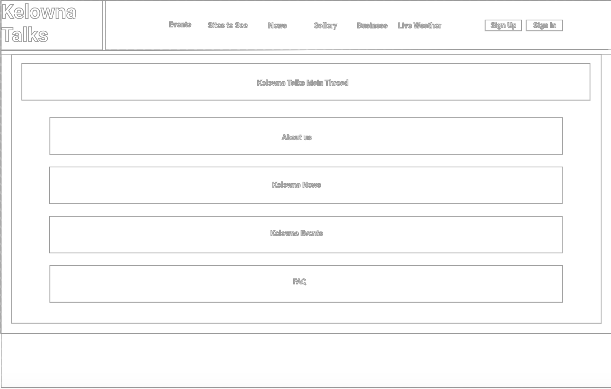
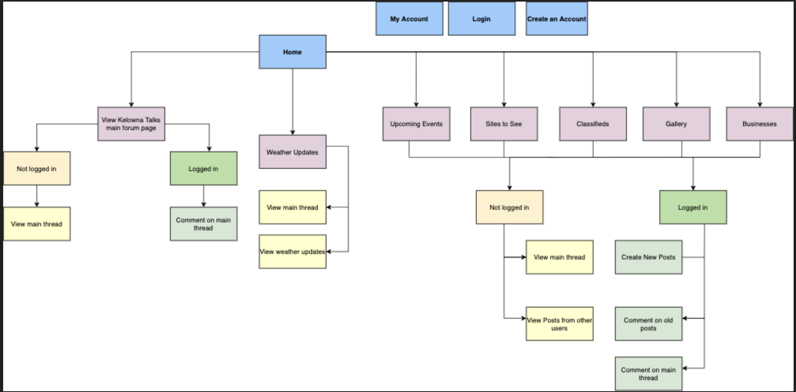
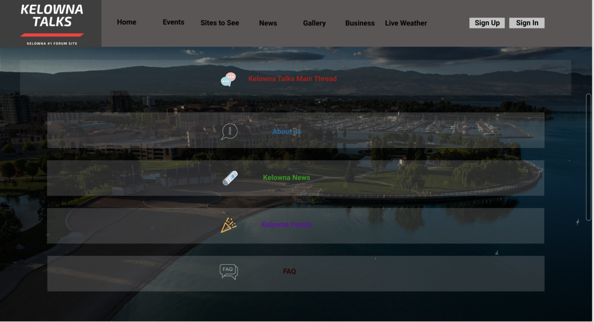
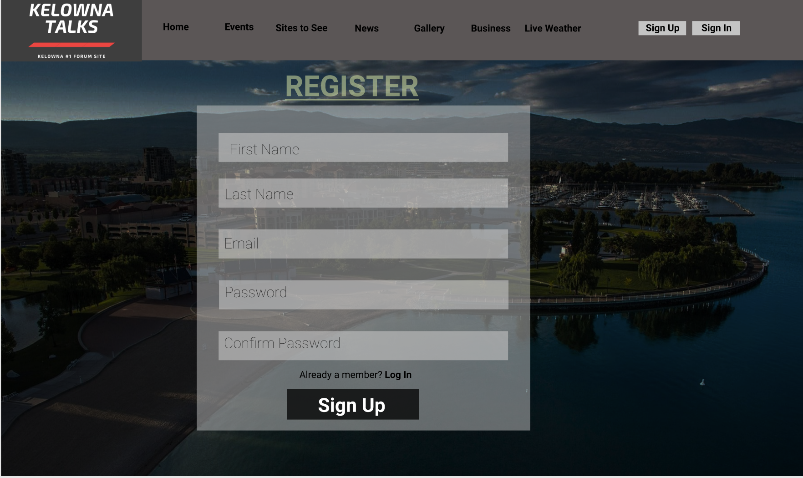
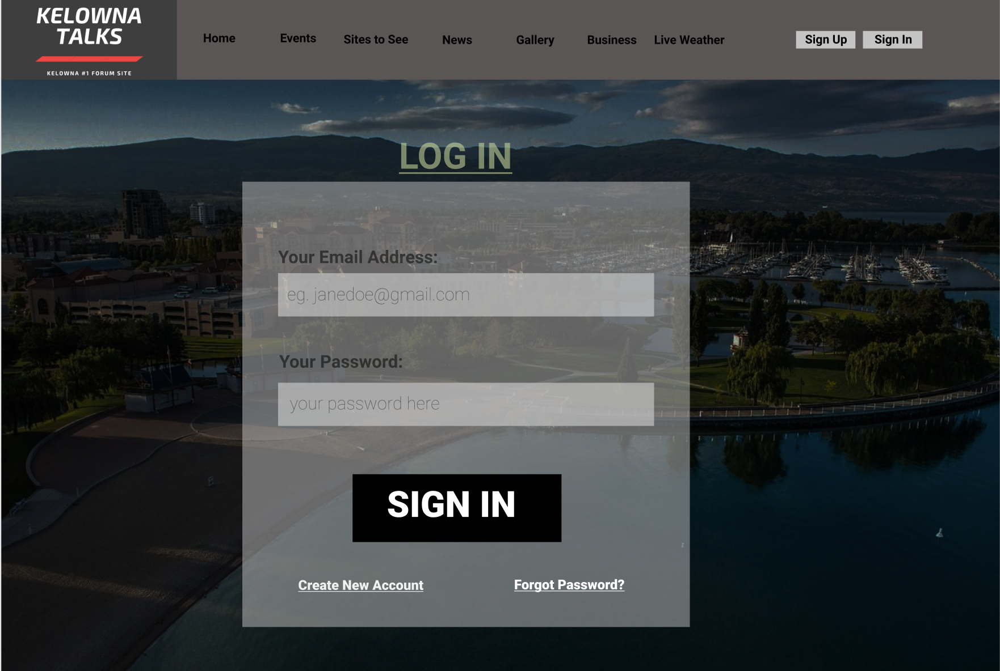
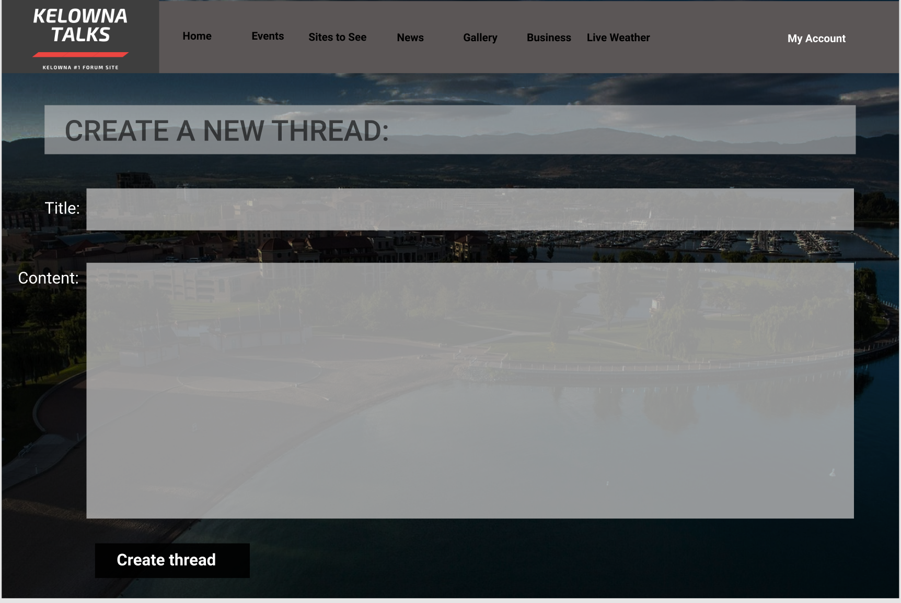
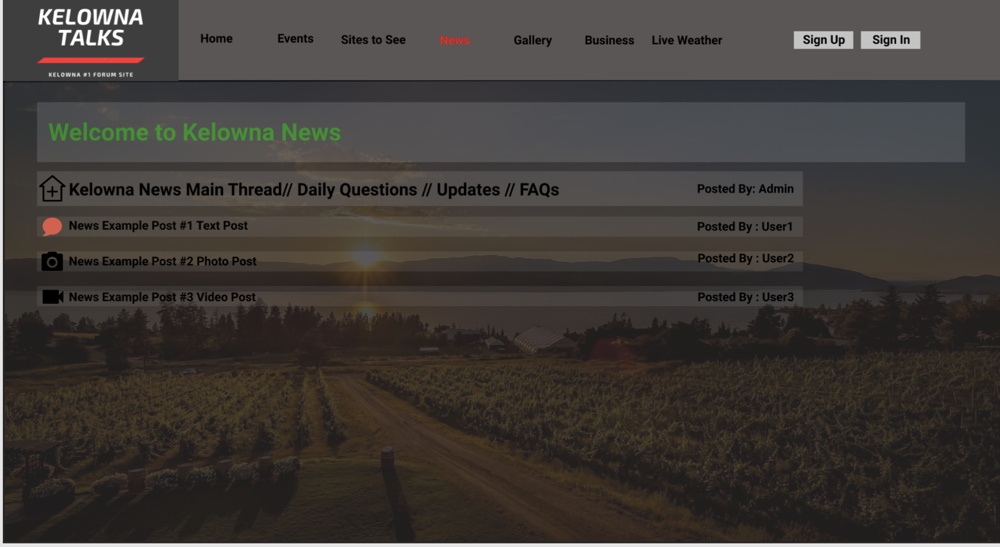

# Client Side Experience / Report

## Layout Document 

Planned layout of the pages for the website. This is our estimation of what our website should look like:

## Organization of pages 

The site map provided below shows how the pages of our website will be linked. 

## Login Process  

**Not Logged In:** 

- An un-registered user can scroll through the main thread, and will have a top nav bar that will link to sign up page as well as another tab which will link to log in page (top right corner)

- An un-registered can sign up by clicking on the sign up button. This will direct them to a registration page where they will be asked questions such as: First Name, Last Name, Email Address, and Set New Password.  

- There will be a menu bar in the center of the page which will have links to the main thread, news, events, and FAQ. Un-registered users can view posts made by others. However, they will not be able to comment on other's posts, or make a new post.

- Registered users can log in with their email address and password if they already have an account.

**Logged In:**

Logged in users have extra features compared to un-registered users: 

- Logged in users have access to a "My Account" tab on the top nav bar which links to information about their account. Users can also edit their profile using the "Edit Profile" button inside "My Account"

- "Edit Profile" links to a page where users can change their username, password, profile photo, email address, and/or phone number. 

- Similar to unregistered users, logged in users can also scroll though the main thread or search using keyowrds.

- Logged in users can also comment on other peoples' posts which appear below the post. 

- Registered users will also have access to click on a button to create a new post which will then be made public so everyone else can view it (_users_ as well as _non users_)

- To make a post, users will require to put information such as title of the post, and content (text and/or images) and then choose a sub category (business, sites to see, upcoming events, classifieds or gallery). 

- Users can edit or delete their posts. 

**Admin:**

- When users are signed in as an admin the nav menu will have a link to the admin page. 

- On the admin page, admins can search users (using username or email), or posts.

- Admins have access to delete any posts (shows up on the top right of each post), or delete any comments made on the post.

- Admins have access to enable/disable account of any user. Disbaling an account will block the user from the forum. When a blocked user tries to log in they will get an error message saying that their account was disabled. 

## Client-side Validation 

- If user enters invalid email format, error message will be shown 

- For new users registering, if any required details are left empty an error message. 

- Check if the passwords match (confirm password), if they don't an error message will be printed out. This applies for registration as well as setting a new password. 

- When on the log in page, checks if the username and password correctly match with respect to the database, if not an error message is shown. 

## Client-side security 

- Can only create an account with an email address that is not already registered. 

- Strong Password Policy 

- Using a secure host

- Website Database kept clean and organized. 

## Examples of each page type

- **Home Page:**

- **Sign Up Page:**

- **Log In Page**

- **Create a new thread:**

For Registered Users Only! 

- **Example of a Subsection:**

There are several sub threads like "Sites to See", "News", "Events", etc. Below is an example of the News subsection (others are similar to it). 

